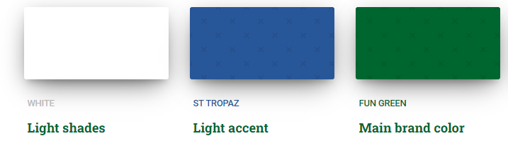

# Hook 'n' Slice - Golf Course Website

 

## Table of contents

- [Hook 'n' Slice - Golf Course Website](#hook-n-slice---golf-course-website)
  - [Table of contents](#table-of-contents)
  - [Overview](#overview)
  - [Site Objectives](#site-objectives)
  - [UX](#ux)
    - [Wireframes](#wireframes)
    - [Site Map](#site-map)
    - [User Journey](#user-journey)
    - [Structure](#structure)
  - [Database](#database)
    - [Database Schema](#database-schema)
  - [Branding](#branding)
    - [Logo ](#logo-)
    - [Colour Scheme](#colour-scheme)
    - [Fonts](#fonts)
  - [Agile Methodology](#agile-methodology)
    - [Prioritisation](#prioritisation)
    - [Sprints](#sprints)
    - [Epics](#epics)
    - [User Stories](#user-stories)
  - [Features](#features)
    - [Existing Features](#existing-features)
      - [Create bookings](#create-bookings)
    - [Future Feature Considerations](#future-feature-considerations)
  - [Responsive Layout and Design](#responsive-layout-and-design)
  - [Tools Used](#tools-used)
    - [Python packages](#python-packages)
  - [Testing](#testing)
  - [Deployment](#deployment)
    - [Deploy on heroku](#deploy-on-heroku)
    - [FORK THE REPOSITORY](#fork-the-repository)
    - [CLONE THE REPOSITORY](#clone-the-repository)
  - [Credits](#credits)
    - [Content](#content)
    - [Media](#media)
    - [Code](#code)
  - [Acknowledgements](#acknowledgements)

## Overview

## Site Objectives

## UX

### Wireframes

I utilized Balsamic (<https://balsamiq.com/wireframes/>) to design the wireframes for my website. I began by creating the wireframes for the desktop version and subsequently adapted the homepage diagram for tablet and mobile devices to display the concept.

  
Desktop Wireframes

  
* [Home Page](static/wireframes/desktop/home-page-desktop.pdf "Home Page")
* [Booking Form](static/wireframes/desktop/booking-form.pdf "Booking Form")
* [Leaderboard](static/wireframes/desktop/leaderboard.pdf "Leaderboard")
* [The Course](static/wireframes/desktop/the-course.pdf "The Course")
* [User Profile](static/wireframes/desktop/user-profile.pdf "User Profile")

  
Mobile and Tablet Concept Wireframes

  
* [Phone Wireframe](static/wireframes/mobile-concept-home-page.pdf "Mobile Concept")
* [Tablet Wireframe](static/wireframes/tablet-concept-home-page.pdf "Tablet Concept")

### Site Map

### User Journey

### Structure

My website development approach will prioritize mobile devices, adopting a mobile-first mindset. To ensure optimal styling across different screen sizes, I will focus on the smallest screen size of the iPhone 5/SE (320px) and incorporate appropriate screen size breakpoints for responsive design.[Bootstrap breakpoints](https://getbootstrap.com/docs/5.0/layout/breakpoints/ "Bootstrap breakpoints").

| Screen Size | Breakpoint |
| ----------- | ---------- |
| x-small     | <576px     |
| small       | => 576px   |
| medium      | => 768px   |
| large       | => 992px   |
| x-large     | => 1200px  |

## Database 

### Database Schema

## Branding 

Hook 'n' Slice Goal is a welcoming brand that fosters a friendly environment specifically designed for new golfers. With a commitment to supporting beginners throughout their golfing journey, we provide a supportive and inclusive space where individuals can learn, grow, and enjoy the game of golf to the fullest.

### Logo 

The logo for Hook 'n' Slice Golf is thoughtfully designed to attract beginner golfers by visually communicating a welcoming and supportive atmosphere, encouraging progression, and evoking a sense of accomplishment in their golfing journey.

  * The two stripes, represent the journey of beginner golfers. The blue represents the initial stages of learning and improvement, while the green symbolizes progress and advancement, this links in with the colour palette of the website. This logo emphasises the purpose of the brand and website which is to inspire beginners by showcasing a path of growth and development in their golfing skills.

  * The golf hole with a flag within the logo emphasizes the feeling of achievement associated with the game of golf. This visual element aims to motivate beginner golfers by showcasing the exciting milestones and accomplishments they can strive for as they progress in their golfing journey.

</img>

### Colour Scheme

The colour scheme for the website is focused on simplicity, trust and calmness all concepts which we hope will attract beginner golfers. The pallete consists of three colours in total; White, a dark green called <strong>Fun Green</strong>and a dark blue called <strong>St Tropaz</strong>.

The darker shades of blue and green have a psychological impact of conveying a sense of trust, reliability and calming which we hope will encourage beigning golfers to choose us as their home of golf.

Purpose of each colour: 

  * Fun Green - #006630 - Main Brand Colour - A vibrant, full-bodied deep green colour to represent the lush green fairways, rolling hills and well-maintained greens this creates a strong connection between the brand and a positive golfing experience. This is the main colour for the brand and aims to symbolises reliability, continuous improvement and progression that beginner golfers strive for in their game.
  
  * St Tropaz - #295899 - Accents - Blue is often associated with calmness, serenity, and tranquility. This shade of blue, conveys a sense of peacefulness and can evoke images of clear skies or water bodies, creating a soothing and relaxing ambiance. It can be particularly appealing to beginner golfers who may seek a tranquil and enjoyable experience on the golf course.

  * White - #ffffff - Background - Creates a clean and simple canvas which will allow other elements such as the text, images and icons to stand out prominently. The fresh look will be particular appealing to beginner golfers who will appreciate a clear and uncluttered background (they already have enough to handle figuring out how to play golf let alone trying to book a tee time)

</img>

### Fonts

## Agile Methodology 

### Prioritisation

### Sprints

### Epics

### User Stories

## Features

### Existing Features

#### Create bookings

### Future Feature Considerations

## Responsive Layout and Design

## Tools Used

### Python packages

## Testing

## Deployment

### Deploy on heroku

### FORK THE REPOSITORY

### CLONE THE REPOSITORY

## Credits

### Content

### Media

### Code

## Acknowledgements
