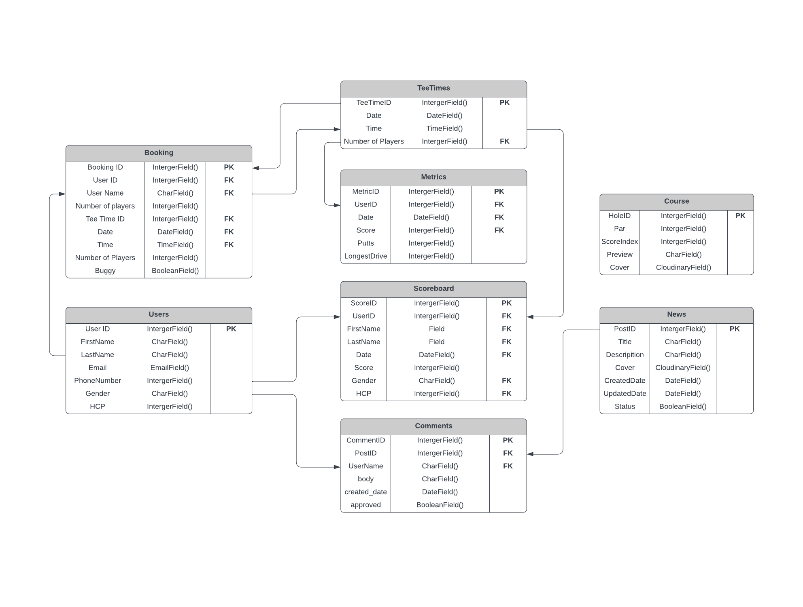
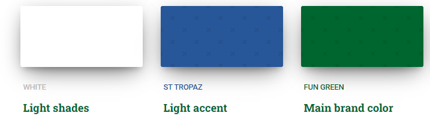

# Hook 'n' Slice - Golf Course Website

 

## Table of contents

- [Hook 'n' Slice - Golf Course Website](#hook-n-slice---golf-course-website)
  - [Table of contents](#table-of-contents)
  - [Overview](#overview)
  - [Site Objectives](#site-objectives)
  - [UX](#ux)
    - [Wireframes](#wireframes)
    - [Site Map](#site-map)
    - [User Journey](#user-journey)
    - [Structure](#structure)
  - [Database](#database)
    - [Database Schema](#database-schema)
  - [Branding](#branding)
    - [Logo ](#logo-)
    - [Colour Scheme](#colour-scheme)
    - [Fonts](#fonts)
  - [Agile Methodology](#agile-methodology)
    - [Prioritisation](#prioritisation)
    - [Sprints](#sprints)
    - [Epics](#epics)
    - [User Stories](#user-stories)
  - [Features](#features)
    - [Existing Features](#existing-features)
      - [Create bookings](#create-bookings)
    - [Future Feature Considerations](#future-feature-considerations)
  - [Tools Used](#tools-used)
    - [Python packages](#python-packages)
  - [Validation](#validation)
  - [Testing](#testing)
  - [Bugs](#bugs)
  - [Deployment](#deployment)
    - [Deploy on heroku](#deploy-on-heroku)
    - [FORK THE REPOSITORY](#fork-the-repository)
    - [CLONE THE REPOSITORY](#clone-the-repository)
  - [Credits](#credits)
    - [Content](#content)
    - [Media](#media)
    - [Code](#code)
  - [Acknowledgements](#acknowledgements)

## Overview

## Site Objectives

## UX

### Wireframes

I utilized Balsamic (<https://balsamiq.com/wireframes/>) to design the wireframes for my website. I began by creating the wireframes for the desktop version and subsequently adapted the homepage diagram for tablet and mobile devices to display the concept.

  
Desktop Wireframes

  
* [Home Page](static/wireframes/desktop/home-page-desktop.pdf "Home Page")
* [Booking Form](static/wireframes/desktop/booking-form.pdf "Booking Form")
* [Leaderboard](static/wireframes/desktop/leaderboard.pdf "Leaderboard")
* [The Course](static/wireframes/desktop/the-course.pdf "The Course")
* [User Profile](static/wireframes/desktop/user-profile.pdf "User Profile")

  
Mobile and Tablet Concept Wireframes

  
* [Phone Wireframe](static/wireframes/mobile-concept-home-page.pdf "Mobile Concept")
* [Tablet Wireframe](static/wireframes/tablet-concept-home-page.pdf "Tablet Concept")

### Site Map

### User Journey

### Structure

My website development approach will prioritize mobile devices, adopting a mobile-first mindset. To ensure optimal styling across different screen sizes, I will focus on the smallest screen size of the iPhone 5/SE (320px) and incorporate appropriate screen size breakpoints for responsive design.[Bootstrap breakpoints](https://getbootstrap.com/docs/5.0/layout/breakpoints/ "Bootstrap breakpoints").

| Screen Size | Breakpoint |
| ----------- | ---------- |
| x-small     | <576px     |
| small       | => 576px   |
| medium      | => 768px   |
| large       | => 992px   |
| x-large     | => 1200px  |

## Database

The project will use the PostgreSQL database for storing data. Two diagramgs were created to show the difference between the initial schema created during the design iteration prior to any development and the final schema created after development was completed.

  
Initial Schema
 
</img>

### Database Schema

## Branding

Hook 'n' Slice Goal is a welcoming brand that fosters a friendly environment specifically designed for new golfers. With a commitment to supporting beginners throughout their golfing journey, we provide a supportive and inclusive space where individuals can learn, grow, and enjoy the game of golf to the fullest.

### Logo 

The logo for Hook 'n' Slice Golf is thoughtfully designed to attract beginner golfers by visually communicating a welcoming and supportive atmosphere, encouraging progression, and evoking a sense of accomplishment in their golfing journey.

- The two stripes, represent the journey of beginner golfers. The blue represents the initial stages of learning and improvement, while the green symbolizes progress and advancement, this links in with the colour palette of the website. This logo emphasises the purpose of the brand and website which is to inspire beginners by showcasing a path of growth and development in their golfing skills.

- The golf hole with a flag within the logo emphasizes the feeling of achievement associated with the game of golf. This visual element aims to motivate beginner golfers by showcasing the exciting milestones and accomplishments they can strive for as they progress in their golfing journey.

</img>

### Colour Scheme

The colour scheme for the website is focused on simplicity, trust and calmness all concepts which we hope will attract beginner golfers. The pallete consists of three colours in total; White, a dark green called <strong>Fun Green</strong> and a dark blue called <strong>St Tropaz</strong>.

The darker shades of blue and green have a psychological impact of conveying a sense of trust, reliability and calming which we hope will encourage beigning golfers to choose us as their home of golf.

Purpose of each colour:

- Fun Green - #006630 - Main Brand Colour - A vibrant, full-bodied deep green colour to represent the lush green fairways, rolling hills and well-maintained greens this creates a strong connection between the brand and a positive golfing experience. This is the main colour for the brand and aims to symbolises reliability, continuous improvement and progression that beginner golfers strive for in their game.

- St Tropaz - #295899 - Accents - Blue is often associated with calmness, serenity, and tranquility. This shade of blue, conveys a sense of peacefulness and can evoke images of clear skies or water bodies, creating a soothing and relaxing ambiance. It can be particularly appealing to beginner golfers who may seek a tranquil and enjoyable experience on the golf course.

- White - #ffffff - Background - Creates a clean and simple canvas which will allow other elements such as the text, images and icons to stand out prominently. The fresh look will be particular appealing to beginner golfers who will appreciate a clear and uncluttered background (they already have enough to handle figuring out how to play golf let alone trying to book a tee time)

</img>

### Fonts

I have used google fonts to select a font type that best supports the goals of the website, to provide a course for beginers to start their golfing journey. For the main text I have selected [Open Sans](https://fonts.google.com/specimen/Open+Sans?preview.text=Open%20Sans&preview.text_type=custom&query=Open+Sans "Open Sans"). To make the headers and the navigation bar stand out form the text, I decided to use [Fredoka](https://fonts.google.com/specimen/Fredoka?preview.text=Open%20Sans&preview.text_type=custom&query=Fredok "Fredoka").

Reasons for choosing the fonts:

- <strong>Open Sans:</strong> is chosen for the body text due to its readability. With a clean and modern appearance, it ensures clear communication of information to beginner golfers, aligning with the brand's focus on simplicity and clarity.

- <strong>Fredoka:</strong> is selected as the title font to bring a playful and friendly element to the brand. With its rounded and inviting design, it adds a touch of excitement and light-heartedness to the headings, perfectly capturing the brand's aim to provide a freindly open environment for beginer golfers to play golf.

## Agile Methodology

### Prioritisation

### Sprints

### Epics

### User Stories

## Features

### Existing Features

#### Create bookings

### Future Feature Considerations

## Tools Used

### Python packages

## Validation

### HTML Validation

The W3C Markup Validation Service

Home

Register

Login

User Profile

Admin Manage Bookings

Booking Form

Booking Confirmation Form

Booking Success

Edit Booking

### CSS Validation

The W3C Jigsaw CSS Validation Service

CSS Validation

### JS Validation

JSHint JS Validation Service

JS Validation

### Python Validation

PEP8 Validation Service was used to check the code for PEP8 requirements via Pycodestyle

Booking

Admin.py

Models.py

URLs.py

Views.py

Forms.py

User Profile

URLs.py

Views.py

Forms.py

Home

URLs.py

Views.py

### Lighthouse

Performance, best practices and SEO was tested using Lighthouse.

#### Desktop

Index

Register

Login

User Profile

Manage Bookings

Bookings

Booking Confirmation Form

Bookings Success

Edit Bookings

#### Mobile

Index

Register

Login

User Profile

Manage Bookings

Bookings

Booking Confirmation Form

Bookings Success

Edit Bookings

### Wave

WAVE was used to test the websites accessibility.

Index

Register

Login

User Profile

Manage Bookings

Bookings

Booking Confirmation Form

Bookings Success

Edit Bookings

## Testing

## Bugs

## Deployment

### Deploy on heroku

1. Generate pipfile

   - Open the terminal and execute the command "pip3 freeze > requirements.txt" to generate a file containing all the necessary requirements.

2. Heroku Setup

   - Access the [Heroku website](https://www.heroku.com/ "Heroku Website").
   - Log in to your Heroku account and select <strong>Create an App</strong>.
   - Click on the <strong>New button</strong> and create an <strong>app</strong>.
   - Select a suitable name and choose your location.
   - Proceed to the <strong>Resources tab</strong>.
   - From the list of resources, pick <strong>Heroku Postgres</strong>.
   - Go to the <strong>Deploy tab</strong>.
   - Click on <strong>Connect to Github</strong> and find your repository.
   - Open the <strong>Settings</strong> tab.
   - Reveal Config Vars and include your Cloudinary, Database URL (from Heroku-Postgres), and Secret Key.

3. Heroku Deployment

   - Visit the <strong>Deploy tab</strong>.
   - Choose the <strong>main branch</strong> for deployment and activate <strong>automatic deployment</strong>.
   - Opt for <strong>manual deployment</strong> to build the application.

### FORK THE REPOSITORY

To create a duplicate of the repository on your account and make modifications without impacting the original project, follow these steps using the Fork feature on GitHub:

- Access the [repository page](https://github.com/Oran-123/Hook-n-Slice-Golf "repository page") on your account.
- In the top right corner of the page, click on the Fork button.
- A forked version of the project will be created and added to your repository.

### CLONE THE REPOSITORY

To create a replica of the repository on your local machine, follow these steps using the Clone feature:

- Access the [repository page](https://github.com/Oran-123/Hook-n-Slice-Golf "repository page") on your account.
- Locate the green <strong>Code</strong> button above the code window and click on it.
- Choose your preferred format from <strong>HTTPS, SSH</strong>, or <strong>GitClub CLI</strong>, and copy the provided URL (preferably HTTPS).
- Open your Integrated Development Environment (IDE) and launch Git Bash.
- Enter the command <strong>git clone</strong> followed by the copied URL in the Git Bash terminal.
- The repository will be cloned, and a local copy will be created on your machine.

## Credits

### Content

### Media

### Code

## Acknowledgements
