# Hook 'n' Slice - Golf Course Website

 

**Developer: Oran Dillon**

💻 [Visit live website](https://hook-n-slice-golf.herokuapp.com/)  
(Ctrl + click to open in new tab)

## Table of contents

- [Hook 'n' Slice - Golf Course Website](#hook-n-slice---golf-course-website)
  - [Table of contents](#table-of-contents)
  - [Overview](#overview)
  - [Site Objectives](#site-objectives)
  - [UX](#ux)
    - [Wireframes](#wireframes)
    - [Site Map](#site-map)
    - [User Journey](#user-journey)
    - [Structure](#structure)
  - [Database](#database)
    - [Database Schema](#database-schema)
  - [Branding](#branding)
    - [Logo ](#logo-)
    - [Colour Scheme](#colour-scheme)
    - [Fonts](#fonts)
  - [Agile Methodology](#agile-methodology)
    - [Prioritisation](#prioritisation)
    - [Sprints](#sprints)
    - [Epics & User Stories](#epics&UserStories)
  - [Features](#features)
    - [Existing Features](#existing-features)
      - [Create bookings](#create-bookings)
    - [Future Feature Considerations](#future-feature-considerations)
  - [Tools Used](#tools-used)
    - [Python packages](#python-packages)
  - [Validation](#validation)
  - [Testing](#testing)
    - [Manual Testing](#manualtesting)
    - [Device & Browser Testing](#device&browsertesting)
  - [Bugs](#bugs)
  - [Deployment](#deployment)
    - [Deploy on heroku](#deploy-on-heroku)
    - [FORK THE REPOSITORY](#fork-the-repository)
    - [CLONE THE REPOSITORY](#clone-the-repository)
  - [Credits](#credits)
    - [Content](#content)
    - [Media](#media)
    - [Code](#code)
  - [Acknowledgements](#acknowledgements)

## Overview

Hook 'n' Slice Golf is an engaging website designed to enhance the golfing experience for beginners. It offers convenient booking for users. With a mobile-first approach, the website prioritizes accessibility and responsiveness.

Developed using Python (Django), HTML, CSS, and JavaScript, with data stored in a PostgreSQL database. The brand aims to create a welcoming and supportive space for golfers to learn, progress, and enjoy the game to the fullest.

## Site Objectives

### User Goals

- To make a booking within a specific teetime
- To be able to view both past and future bookings
- To be able to delete/cancel future bookings
- To be able to update/edit future bookings

### Site Owner Goals

- To provide a solution to allow users to book a teetime online
- To provide a simple and intuative design
- To create a fully responsive website
- To attract more business and users to the club
- To have an admin area that is only accessible by staff
- To manage bookings in the admin area

## UX

### Wireframes

I utilized Balsamic (<https://balsamiq.com/wireframes/>) to design the wireframes for my website. I began by creating the wireframes for the desktop version and subsequently adapted the homepage diagram for tablet and mobile devices to display the concept.

  
Desktop Wireframes

  
* [Home Page](docs/wireframes/desktop/home-page-desktop.pdf "Home Page")
* [Booking Form](docs/wireframes/desktop/booking-form.pdf "Booking Form")
* [Leaderboard](docs/wireframes/desktop/leaderboard.pdf "Leaderboard")
* [The Course](docs/wireframes/desktop/the-course.pdf "The Course")
* [User Profile](docs/wireframes/desktop/user-profile.pdf "User Profile")

  
Mobile and Tablet Concept Wireframes

  
* [Phone Wireframe](docs/wireframes/mobile-concept-home-page.pdf "Mobile Concept")
* [Tablet Wireframe](docs/wireframes/tablet-concept-home-page.pdf "Tablet Concept")

### Site Map

### User Journey

### Structure

My website development approach will prioritize mobile devices, adopting a mobile-first mindset. To ensure optimal styling across different screen sizes, I will focus on the smallest screen size of the iPhone 5/SE (320px) and incorporate appropriate screen size breakpoints for responsive design.[Bootstrap breakpoints](https://getbootstrap.com/docs/5.0/layout/breakpoints/ "Bootstrap breakpoints").

| Screen Size | Breakpoint |
| ----------- | ---------- |
| x-small     | <576px     |
| small       | => 576px   |
| medium      | => 768px   |
| large       | => 992px   |
| x-large     | => 1200px  |

## Database

### Database Overview

The project will use the PostgreSQL database for storing data. Two diagramgs were created to show the difference between the initial schema created during the design iteration prior to any development and the final schema created after development was completed.

### Database Schema

  
Planned Schema
 
</img>

  
Implemented Schema
 
</img>

## Branding

Hook 'n' Slice Goal is a welcoming brand that fosters a friendly environment specifically designed for new golfers. With a commitment to supporting beginners throughout their golfing journey, we provide a supportive and inclusive space where individuals can learn, grow, and enjoy the game of golf to the fullest.

### Logo 

The logo for Hook 'n' Slice Golf is thoughtfully designed to attract beginner golfers by visually communicating a welcoming and supportive atmosphere, encouraging progression, and evoking a sense of accomplishment in their golfing journey.

- The two stripes, represent the journey of beginner golfers. The blue represents the initial stages of learning and improvement, while the green symbolizes progress and advancement, this links in with the colour palette of the website. This logo emphasises the purpose of the brand and website which is to inspire beginners by showcasing a path of growth and development in their golfing skills.

- The golf hole with a flag within the logo emphasizes the feeling of achievement associated with the game of golf. This visual element aims to motivate beginner golfers by showcasing the exciting milestones and accomplishments they can strive for as they progress in their golfing journey.

</img>

### Colour Scheme

The colour scheme for the website is focused on simplicity, trust and calmness all concepts which we hope will attract beginner golfers. The pallete consists of three colours in total; White, a dark green called <strong>Fun Green</strong> and a dark blue called <strong>St Tropaz</strong>.

The darker shades of blue and green have a psychological impact of conveying a sense of trust, reliability and calming which we hope will encourage beigning golfers to choose us as their home of golf.

Purpose of each colour:

- Fun Green - #006630 - Main Brand Colour - A vibrant, full-bodied deep green colour to represent the lush green fairways, rolling hills and well-maintained greens this creates a strong connection between the brand and a positive golfing experience. This is the main colour for the brand and aims to symbolises reliability, continuous improvement and progression that beginner golfers strive for in their game.

- St Tropaz - #295899 - Accents - Blue is often associated with calmness, serenity, and tranquility. This shade of blue, conveys a sense of peacefulness and can evoke images of clear skies or water bodies, creating a soothing and relaxing ambiance. It can be particularly appealing to beginner golfers who may seek a tranquil and enjoyable experience on the golf course.

- White - #ffffff - Background - Creates a clean and simple canvas which will allow other elements such as the text, images and icons to stand out prominently. The fresh look will be particular appealing to beginner golfers who will appreciate a clear and uncluttered background (they already have enough to handle figuring out how to play golf let alone trying to book a tee time)

</img>

### Fonts

I have used google fonts to select a font type that best supports the goals of the website, to provide a course for beginers to start their golfing journey. For the main text I have selected [Open Sans](https://fonts.google.com/specimen/Open+Sans?preview.text=Open%20Sans&preview.text_type=custom&query=Open+Sans "Open Sans"). To make the headers and the navigation bar stand out form the text, I decided to use [Fredoka](https://fonts.google.com/specimen/Fredoka?preview.text=Open%20Sans&preview.text_type=custom&query=Fredok "Fredoka").

Reasons for choosing the fonts:

- <strong>Open Sans:</strong> is chosen for the body text due to its readability. With a clean and modern appearance, it ensures clear communication of information to beginner golfers, aligning with the brand's focus on simplicity and clarity.

- <strong>Fredoka:</strong> is selected as the title font to bring a playful and friendly element to the brand. With its rounded and inviting design, it adds a touch of excitement and light-heartedness to the headings, perfectly capturing the brand's aim to provide a freindly open environment for beginer golfers to play golf.

## Agile Methodology

### Prioritisation

After developing my backlog of criteria I reviewed each user story in respect to the epic goal and set the priority of the user story using labels in github proejects.

To deterimine the priority I use the MoSCoW prioritization technique which is widely-used agile project management that aids in making informed decisions about which requirements or features should take precedence during development. The method involves dividing requirements into four categories:

1. Must Have (M): These are critical features that are non-negotiable and must be delivered in the current release. They form the core functionality and are essential for the project's success.

2. Should Have (S): These are important features that significantly enhance the product but are not as critical as 'Must Have' items. They are considered essential for the overall project success but may be deferred to a later release if necessary.

3. Could Have (C): These are desirable features, but their absence does not hinder the core functionality. They represent enhancements or nice-to-haves that can be considered for inclusion if time and resources allow.

4. Won't Have (W): These are features deemed unnecessary for the current project scope. They are intentionally excluded from the development process, either due to time constraints, technical limitations, or low business value. In my project no label was used to represent the won't have user stories. Instead during each sprint if a user story could not be completed then the story was moved to the status descoped to represent it wouldn't be included in the scope of the project.

In my project some of user stories were not completed even if they were marked with the label Must Have. This is becasue the overall Epic the User Story relates to was descoped due to capacity restraints.

### Sprints

### Epics & User Stories

There was a total of 50 user stories and 11 epic created in my backlog.

Only 22 of the user stories were completed, 28 were moved to descoped as there was not enough time to complete the associated epic. All of the user stories can be found on the following [Git Hub board](https://github.com/users/Oran-123/projects/2/views/1?visibleFields=%5B%22Title%22%2C%22Assignees%22%2C%22Status%22%2C43732427%2C%22Labels%22%2C%22Milestone%22%5D&layout=board&filterQuery=)

The below table includes the Epic, User Stories and the Acceptance Criteria of the User Stories that were completed:

| **Epic**                  | **User Story**                                     | **Acceptance Criteria**                                                                                                                                |
| ------------------------- | -------------------------------------------------- | ------------------------------------------------------------------------------------------------------------------------------------------------------ |
| EPIC 1: Design            | 1. Intuitive design and flow to the website layout | as a User, I want the website to have a intuitive layout and design so that a positive user experience is elicited when navigating the site            |
| EPIC 1: Design            | 2. Logo & Name                                     | as a Logged-In User, I want to log out of my account from any page so that I do not leave the site logged in                                           |
| EPIC 1: Design            | 3. Typography                                      | as a User, I want to select suitable fonts so that they align with the playful brand theme of Hook n' Slice Golf                                       |
| EPIC 1: Design            | 4. Database Entity Relationship Diagram            | as a developer, I want to design the database schema so that I can create the models to store relevant information                                     |
| EPIC 1: Design            | 5. Website Wireframes                              | as a developer, I want to create a set of wireframes for all screens so that I can visualize the website structure and layout                          |
| EPIC 1: Design            | 6. Color Scheme                                    | as a a developer, I want to choose a color palete so that the website passes accessibility requirements                                                |
| EPIC 2: Tee Time Booking  | 7. Find Available Tee Times                        | as a User, I want to view available tee times for specific dates and group sizes so that I can make a decision on what tee time I want to book         |
| EPIC 2: Tee Time Booking  | 8. Booking Confirmation                            | as a Logged-In User, I want receive confirmation of the booking and its cost so that I know that it was successful                                     |
| EPIC 2: Tee Time Booking  | 9. Book A Tee Time                                 | as a Logged-In User, I want receive confirmation of the booking and its cost so that I know that it was successful                                     |
| EPIC 5: User Profile      | 10. List of Upcoming Tee Times                     | as a Logged-In User, I want to see a list of the upcoming tee-times I booked so that I don't miss a booking                                            |
| EPIC 5: User Profile      | 11. Delete Bookings (Tee-Times)                    | as a Logged-In User, I want to delete/cancel future tee-times I have booked so that I can inform the club if I cannot attend a tee-time                |
| EPIC 5: User Profile      | 12. Edit Booking Details                           | as a Logged-In User, I want update booking details such as time, date and number of players so that I can inform the club in any changes to my booking |
| EPIC 5: User Profile      | 13. View a List of Past Tee Times                  | as a Logged-In User, I want see a list of past tee-times so that I can keep a record of the rounds of golf I have played                               |
| EPIC 6: Admin Actions     | 14. View All User Bookings                         | as a Admin User, I want to view all user bookings so that I can manage bookings for the course                                                         |
| EPIC 6: Admin Actions     | 15. Admin Login                                    | as a site-owner, I want login as an admin so that I can view user bookings, messages and update site content                                           |
| EPIC 6: Admin Actions     | 16. Cancel user bookings                           | as a Admin User, I want the ability to cancel users bookings so that I can manually update bookings on behalf of users                                 |
| EPIC 8: Navigation        | 17. Responsive Navigation                          | as a User, I want the site to have a responsive navigation bar so that I can clearly see all options on desktop/tablet/mobile devices                  |
| EPIC 8: Navigation        | 18. Call To Actions to Book On All Pages           | as a User, I want the ability to access the booking app from all web pages so that booking a teet time is intuitive and easy                           |
| EPIC 8: Navigation        | 19. Alerts to notify when logged in/logged out     | as a User, I want receive alerts when I login and logout so that I see confirmation of my login status                                                 |
| EPIC 9: User Registration | 20. Login using user name and password only        | as a User, I want I want to be able to login to my account with email and password only so that accessing my account is intuitive                      |
| EPIC 9: User Registration | 21. Register An Account                            | as a User, I want to register an account so that I can make and amend bookins                                                                          |
| EPIC 9: User Registration | 22. logout anytime                                 | as a Logged-In User, I want to log out of my account from any page so that I do not leave the site logged in                                           |

## Features

### Existing Features

#### Home Page

- An inviting and visually appealing home page that introduces users to Hook 'n' Slice Golf's unique offerings.
- Includes call outs on why users should join the club
- Call to action included to make a booking
- <strong>Covers User Stories</strong>:

See Feature Image

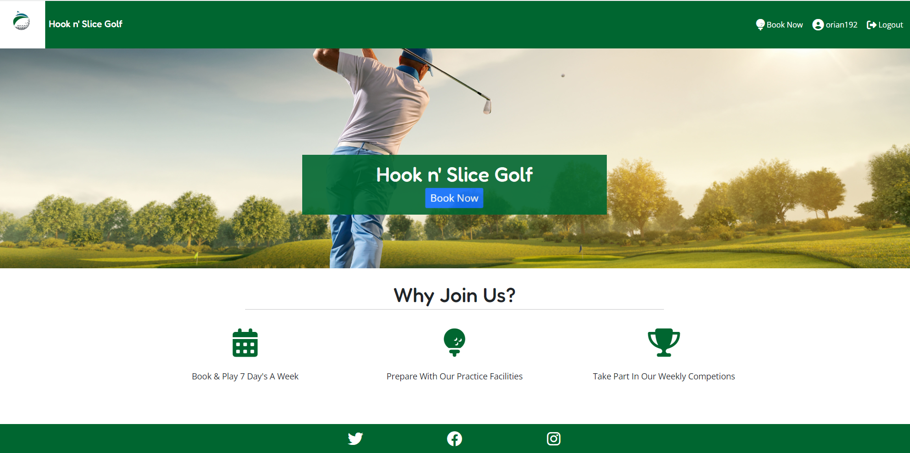

#### Nav Bar

- A responsive navigation bar that adapts seamlessly to various screen sizes.
- Includes clear and intuitive menu items for easy navigation, ensuring users can access different sections of the website effortlessly.
- Fixed to the top of the view port so that users can always access the nav bar regardless of which page they are on
- Logo and site name includes a link back to the home page
- <strong>Covers User Stories</strong>:

Desktop Nav Bar

Mobile Nav Bar

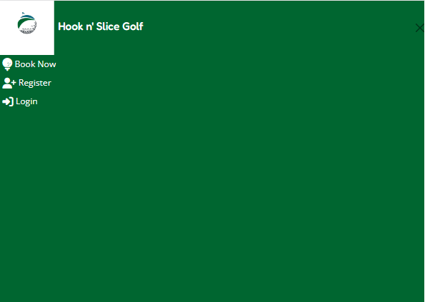

#### Nav Menu

- A responsive navigation menu that provides easy access to all essential sections of the website, such as Home, Book Now, User Profile, and Admin Manage Bookings.
- The menu is user-friendly, and collapsible on smaller screens (e.g., mobile devices) to ensure a seamless browsing experience.
- Depedning on whether the user is a super user or a standard user different menu items will appear
- The menu items will change depeding on whether the user is signed-in or logged out

Super User Nav Menu

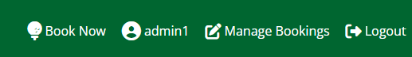

Standard User Nav Menu

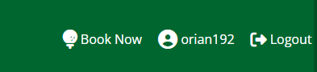

Logged Out Nav Menu

#### Call To Action Button

- A prominent and eye-catching call-to-action button on the home page to encourage users to book tee times.
- The button will direct users to the booking section, enticing them to take action and make a reservation.
- If the user is not signed in the booking will state different text and first direct the user to the sign-in form before the find a teetime form
- The CTA has a fade animation to attract the user
- <strong>Covers User Stories</strong>:

CTA When User Is Signed-In

CTA When User Is Not Signed-In

#### Why Join Us Icons

- A set of eye-catching icons are included on the website's landing page to highlight the key benefits and reasons why users should join Hook 'n' Slice Golf.
- Each icon represents a specific advantage, such as state-of-the-art facilities, and a vibrant golfing community and the intuative booking system.
- The icons will help attract and engage potential users by visually conveying the unique selling points of the golfing experience offered by Hook 'n' Slice Golf.

Why Joing Us Icons

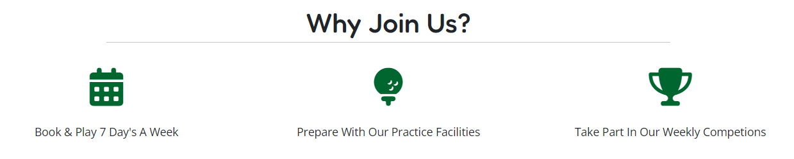

#### Login Form

- A user-friendly login page where users can sign in to their accounts.
- Fields included for logging in with username and password or a link to create an account if the user does not have an account.
- Both the username and password fields are mandatory and validation is applied so the user must enter a value before they can submit the form
- <strong>Covers User Stories</strong>:

Sign-In Form

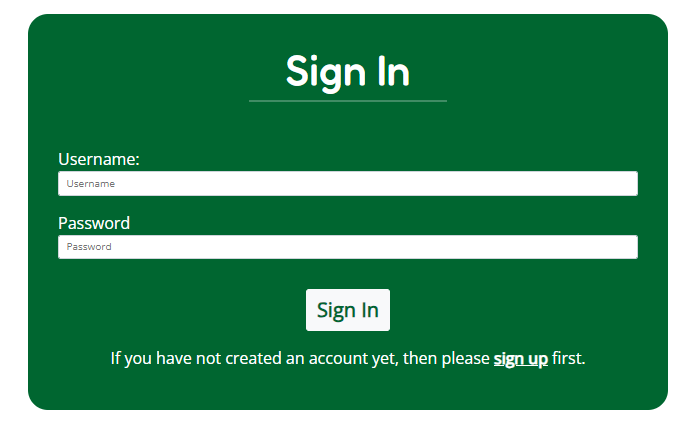

Sign-In Form Validation

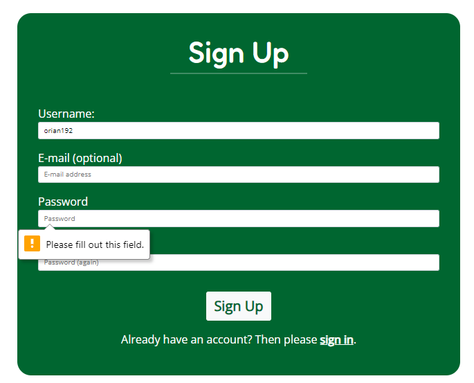

#### Register

- A registration page with a form for new users to create accounts.
- Captures essential user information, such as name, email, and password, to facilitate future bookings and user profile management.
- Validation applie to mandatory fields
- <strong>Covers User Stories</strong>:

Register Form

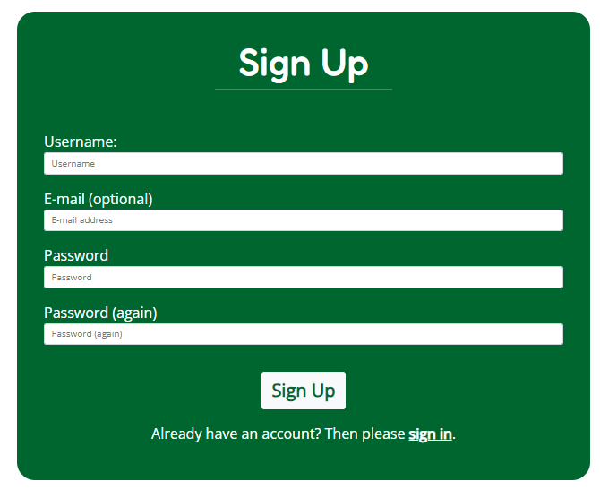

Register Form Validation

#### Logout Modal

- If a user clicks on the logout button they will be presetned with a logout modal to confirm they wish to logout

Logout Modal

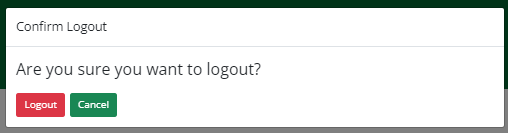

#### Find A Tee Time Form

- A user-friendly form where users can search for available tee times based on specific criteria.
- Include fields for date, time, and number of players.
- Validation on the form prevents users from searching for TeeTimes in the past, for Tee Times that do not have sufficent space for the number of players and it prevents the user from entering a start time that is later then the end time

Find A Tee Time Form

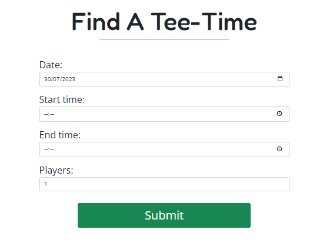

Find A Tee Time Form  Validation

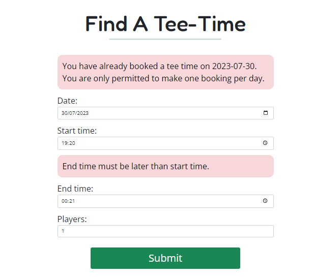

#### Available Tee Time Cards

- Visually appealing and informative cards to display the available tee times matching the user's search criteria.
- Each card presents essential details, such as date, time, and available slots, to help users make an informed decision.
- Each card includes a button to book the tee time

Available Tee Time Cards

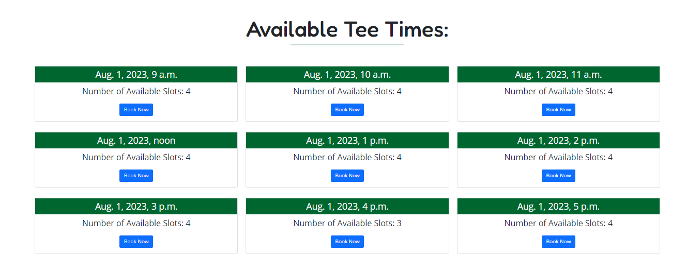

#### Confirm Booking Details Form

- A booking confirmation form that displays all relevant details before finalizing a tee time reservation.
- Fields are all read only except for the buggy which is a check box that can be populated by the user
- Users can review the date, time, number of players before confirming the booking.
- <strong>Covers User Stories</strong>:

Booking Confirmation Form

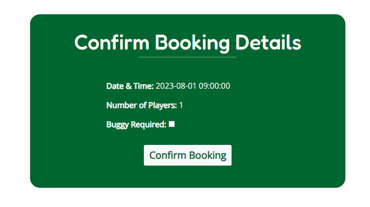

#### Booking Success page

- A booking success page that appears after users successfully complete a reservation.
- Display a confirmation message and provide booking details for users to keep as reference including the booking id.
- A call to action to make another booking is included
- <strong>Covers User Stories</strong>:

Booking Success Page

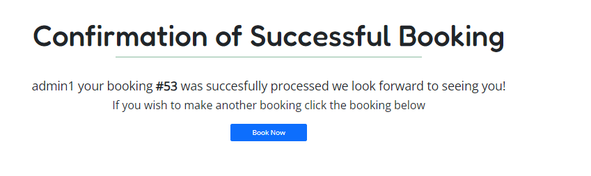

#### User Profile

- A dedicated user profile section where users can manage their bookings.
- Users can filter between past and future bookings
- A CTA to create a new booking is included if there are no future bookings
- Users can edit or cancel bookings if needed.
- <strong>Covers User Stories</strong>:

User Profile Future Bookings

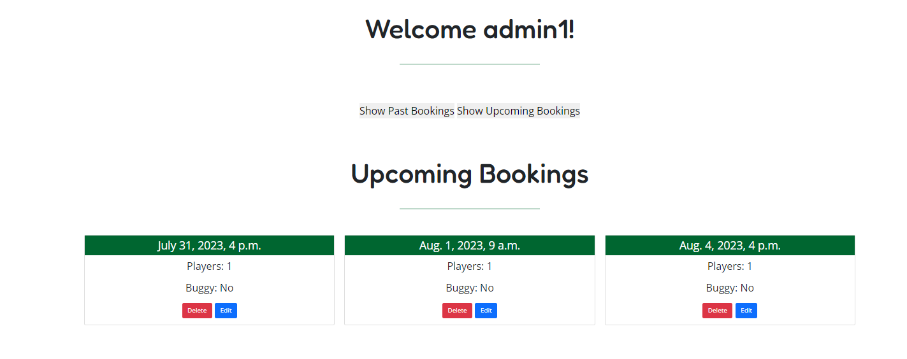

User Profile Past Bookings

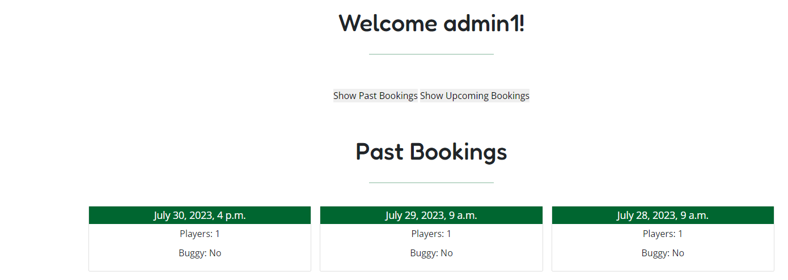

#### Edit Bookings Forms

- Enable users to modify their existing tee time bookings through the user profile section.
- Users can update booking details, such as date, time, number of players and if they require a buggy, based on their preferences.
- The form will default to the users current selection for date time, players and if a buggy is required
- The user will be prevented from chaning the date of their current booking to a date on which they have a seperate booking

Edit Booking Form

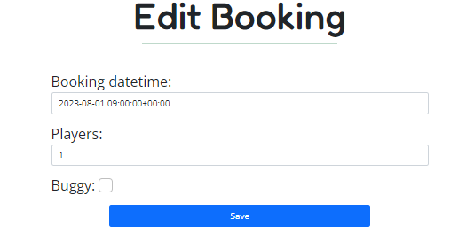

#### Delete Modal

- If a user attempts to delte a booking they will be presented with a delete modal asking them if they wish to confirm the deletion of the booking

Delete Modal

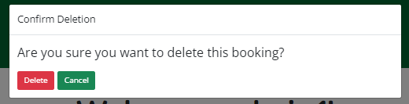

#### Admin Manage Booking Page

- Implement an admin page that allows staff members to view and manage all user bookings.
- Admin users can view update and delete bookings to efficiently handle course reservations.
- Pagination included on the table so that only 10 results will be displayed on each page and the user can navigate through the page using the controls under the table

Manage Bookings

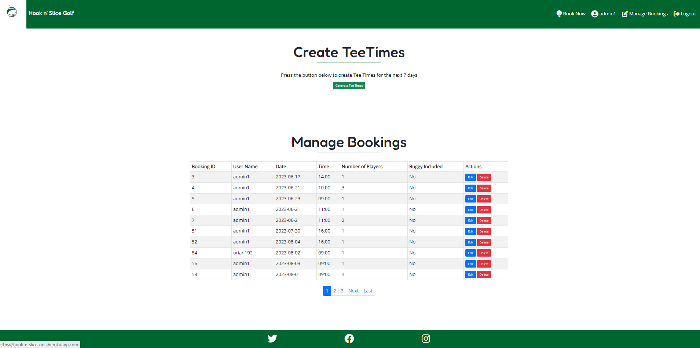

#### Footer

- A footer section that appears at the bottom of every page
- Include social media links for users' convenience.

Footer

#### Alerts

- Alerts appear at the top of the view port for users if they create, update or delte any of the bookings
- Alerts appear at the top of the view port for users when they login and logout of the site

Alerts

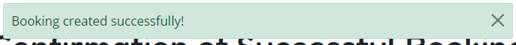
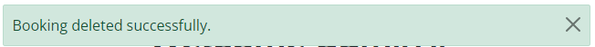
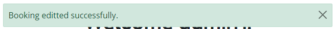
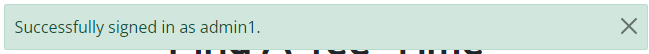
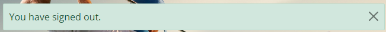

### Future Feature Considerations

#### Leaderboard

- Implement a dynamic leaderboard that displays the top-performing players based on their scores and progress in various golf games, providing healthy competition among users.
- Allow users to filter the leaderboard based on different criteria, date range, or handicap, to view rankings that are relevant to their preferences.

#### Metrics

- Develop a comprehensive metrics system that tracks user performance and golfing statistics, such as average score, fairways hit, greens in regulation, and more.
- Provide users with personalized insights and analysis of their golfing data, enabling them to identify areas for improvement and track their progress over time.

#### Manage Booking Filters

- Develop a user-friendly filtering system for managing bookings in the manage booking admin page.
- Admin users will be able to filter bookings based on various criteria, such as date, tee time slot, user name, and booking status, streamlining the process of managing and organizing tee time reservations.

#### Forgot Email

- Implement a "Forgot Email" functionality to assist users in recovering their account email address.
- Users who forget their registered email address will be able to provide their username or other account information, and the system will send an email containing their account email address, helping them regain access to their account.

#### Email Confirmation For Bookings

- Implement an automated email confirmation system that sends users a confirmation email after they successfully book a tee time.
- The email will include details of their booking, such as date, time, number of players, and a unique booking reference, ensuring users have all the necessary information for their tee time.

#### Payments

- Integrate a secure payment gateway to facilitate online payments for tee time bookings and other services offered by Hook 'n' Slice Golf.
- Allow users to securely enter their payment information and process transactions, providing a seamless and convenient booking experience while ensuring the safety of their financial data.

## Tools Used

### Languages & Frameworks

- HTML
- CSS
- Javascript
- Python
- Django

### Libraries

- [Am I Responsive](http://ami.responsivedesign.is/)
- [Balsamiq](https://balsamiq.com/)
- [Bootstrap v5.2](https://getbootstrap.com/)
- [Cloudinary](https://cloudinary.com/)
- [Favicon.io](https://favicon.io)
- [Chrome dev tools](https://developers.google.com/web/tools/chrome-devtools/)
- [Font Awesome](https://fontawesome.com/)
- [Git](https://git-scm.com/)
- [GitHub](https://github.com/)
- [Google Fonts](https://fonts.google.com/)
- [Heroku Platform](https://id.heroku.com/login)
- [jQuery](https://jquery.com)
- [Postgres](https://www.postgresql.org/)
- [LucidChart](https://www.lucidchart.com/)
- Validation:
  - [WC3 Validator](https://validator.w3.org/)
  - [Jigsaw W3 Validator](https://jigsaw.w3.org/css-validator/)
  - [JShint](https://jshint.com/)
  - [Pycodestyle(PEP8)](https://pypi.org/project/pycodestyle/)
  - [Lighthouse](https://developers.google.com/web/tools/lighthouse/)
  - [Wave Validator](https://wave.webaim.org/)

### Python packages

- <strong>asgiref</strong>: ASGI (Asynchronous Server Gateway Interface) reference implementation. It provides utility functions for working with ASGI applications and servers.
- <strong>cloudinary</strong>: A Python SDK for the Cloudinary service, which is used for managing media files, such as images and videos, in the cloud.
- <strong>dj-database-url</strong>: A utility to configure Django database settings using URLs. It allows you to specify the database connection parameters in a single URL string.
- <strong>dj3-cloudinary-storage</strong>: A Django storage backend for Cloudinary, allowing you to use Cloudinary as a storage backend for your Django media files.
- <strong>Django</strong>: The web framework for Python. Django provides a high-level development environment for building web applications quickly and efficiently.
- <strong>django-admin-rangefilter</strong>: A Django admin application that adds the ability to filter by date ranges.
- <strong>django-allauth</strong>: A Django package for handling user authentication, registration, and account management.
- <strong>gunicorn</strong>: A Python WSGI HTTP server that is commonly used for deploying Django applications in production.
- <strong>oauthlib</strong>: A Python library for working with OAuth 1.0 and 2.0 service providers.
- <strong>pip-check</strong>: A tool to check for outdated, missing, or unused Python package dependencies.
- <strong>psycopg2</strong>: A PostgreSQL adapter for Python, used for connecting Django to a PostgreSQL database.
- <strong>PyJWT</strong>: A Python library for encoding and decoding JSON Web Tokens (JWT).
- <strong>python3-openid</strong>: A library for working with OpenID authentication, an older standard for user authentication.
- <strong>pytz</strong>: A Python library for working with timezone information.
- <strong>requests-oauthlib</strong>: A library that provides OAuth support for Python Requests.
- <strong>sqlparse</strong>: A non-validating SQL parser for Python.
- <strong>terminaltables</strong>: A library for rendering simple tables in the terminal.
- <strong>urllib3</strong>: A powerful HTTP client for Python, used by many Python libraries for making HTTP requests.

## Validation

### HTML Validation

The W3C Markup Validation Service

Home

Register

Login

User Profile

Admin Manage Bookings

Booking Form

Booking Confirmation Form

Booking Success

Edit Booking

### CSS Validation

The W3C Jigsaw CSS Validation Service

CSS Validation

### JS Validation

JSLint JS Validation Service

JS Validation

### Python Validation

PEP8 Validation Service was used to check the code for PEP8 requirements via Pycodestyle

#### Booking

Admin.py

Models.py

URLs.py

Views.py

Forms.py

#### User Profile

URLs.py

Views.py

Forms.py

#### Home

URLs.py

Views.py

### Lighthouse

Performance, best practices and SEO was tested using Lighthouse.

#### Desktop

Index

Register

Login

User Profile

Manage Bookings

Bookings

Booking Confirmation Form

Bookings Success

Edit Bookings

#### Mobile

Index

Register

Login

User Profile

Manage Bookings

Bookings

Booking Confirmation Form

Bookings Success

Edit Bookings

### Accessibility

WAVE was used to test the websites accessibility.

Index

Register

Login

User Profile

Manage Bookings

Bookings

Booking Confirmation Form

Bookings Success

Edit Bookings

## Testing

### Manual Testing

| Test Case                                      | Steps                                                                                                                                           | Expected Result                                                                                                                   | Actual Result |
| ---------------------------------------------- | ----------------------------------------------------------------------------------------------------------------------------------------------- | --------------------------------------------------------------------------------------------------------------------------------- | ------------- |
| View Homepage                                  | 1. Navigate to the homepage of the golf course website.                                                                                         | The homepage should load with relevant content and a navigation bar.                                                              | -             |
| Navigate to Register Page                      | 1. Click on the 'Register' link in the navigation bar.                                                                                          | The user should be redirected to the registration page.                                                                           | -             |
| Register a New User                            | 1. Fill out the registration form with valid user details. 2. Submit the form.                                                                  | The user should be successfully registered, and a success message should be displayed.                                            | -             |
| Navigate to Login Page                         | 1. Click on the 'Login' link in the navigation bar.                                                                                             | The user should be redirected to the login page.                                                                                  | -             |
| Login as a Registered User                     | 1. Fill out the login form with valid credentials. 2. Submit the form.                                                                          | The user should be logged in and redirected to their profile page.                                                                | -             |
| View Available Tee Times                       | 1. Navigate to the 'Book Tee Time' page.                                                                                                        | The page should display a calendar with available tee times for booking.                                                          | -             |
| Book a Tee Time                                | 1. Select a date and time from the available tee times. 2. Click the 'Book Now' button.                                                         | The user should be able to book the selected tee time, and a confirmation message should be displayed.                            | -             |
| View My Bookings                               | 1. Navigate to the 'My Bookings' page.                                                                                                          | The page should display a list of the user's booked tee times.                                                                    | -             |
| Edit Booking                                   | 1. Navigate to the 'My Bookings' page. 2. Click on the 'Edit' button for a booked tee time. 3. Select a new date and time. 4. Save the changes. | The booked tee time should be updated with the new date and time, and a success message should be displayed.                      | -             |
| Cancel Booking                                 | 1. Navigate to the 'My Bookings' page. 2. Click on the 'Cancel' button for a booked tee time. 3. Confirm the cancellation.                      | The booked tee time should be canceled, and a success message should be displayed.                                                | -             |
| Logout                                         | 1. Click on the 'Logout' link in the navigation bar.                                                                                            | The user should be logged out and redirected to the homepage.                                                                     | -             |
| Access Admin Panel                             | 1. Log in as an administrator. 2. Navigate to the admin panel.                                                                                  | The administrator should be able to access the admin panel with administrative privileges.                                        | -             |
| Manage Bookings in Admin Panel                 | 1. Log in as an administrator. 2. Navigate to the admin panel. 3. Access the 'Bookings' section.                                                | The administrator should be able to view and manage all bookings, such as editing or canceling bookings.                          | -             |
| Manage Users in Admin Panel                    | 1. Log in as an administrator. 2. Navigate to the admin panel. 3. Access the 'Users' section.                                                   | The administrator should be able to view and manage all registered users, such as editing user details or deleting user accounts. | -             |
| Filter Bookings by Date in Admin Panel         | 1. Log in as an administrator. 2. Navigate to the admin panel. 3. Access the 'Bookings' section. 4. Apply a date filter.                        | The admin should see bookings filtered by the selected date range.                                                                | -             |
| Search Bookings by User in Admin Panel         | 1. Log in as an administrator. 2. Navigate to the admin panel. 3. Access the 'Bookings' section. 4. Enter a user's                              | name in the search box. The admin should see bookings filtered by the searched user.                                              | -             |
| View Booking Details in Admin Panel            | 1. Log in as an administrator. 2. Navigate to the admin panel. 3. Access the 'Bookings' section. 4. Click on a booking to view details.         | The admin should see the details of the selected booking.                                                                         | -             |
| Generate Booking Report in Admin Panel         | 1. Log in as an administrator. 2. Navigate to the admin panel. 3. Access the 'Reports' section. 4. Generate a booking report.                   | The admin should be able to generate a report containing all bookings within a specified date range.                              | -             |
| Handle Invalid Input for Booking Date and Time | 1. Navigate to the 'Book Tee Time' page. 2. Submit the booking form without selecting a date and time.                                          | The user should see a validation error indicating the need to select a date and time.                                             | -             |
| Try to Book a Past Date                        | 1. Navigate to the 'Book Tee Time' page. 2. Select a past date from the available tee times. 3. Click the 'Book Now' button.                    | The user should see a validation error indicating that booking a past date is not allowed.                                        | -             |
| Try to Book a Duplicate Tee Time               | 1. Navigate to the 'Book Tee Time' page. 2. Select a date and time that has already been booked. 3. Click the 'Book Now' button.                | The user should see                                                                                                               | -             |

### Device Testing & Browser compatibility

The [BrowserStack](https://live.browserstack.com/dashboard) was used to test the site on real devices

The following devices were used to test my site:

#### Devices

- Samsung Galaxy S22 Ultra
- Apple iPhone 14
- Apple iPhone 13
- Apple iPhone 12 Pro
- Apple iPhone 12
- Google Pixel 5

#### Browsers

- Mozilla Firefox
- Google Chrome
- Safari
- Microsoft Edge

## Bugs

| **Bug**                                   | **Fix**      |
| ----------------------------------------- | ------------ |
| Register form formatting on Apple Devices | existing bug |
|                                           |              |
|                                           |              |
|                                           |              |
|                                           |              |
|                                           |              |
|                                           |              |
|                                           |              |

## Deployment

### Deploy on heroku

1. Generate pipfile

   - Open the terminal and execute the command "pip3 freeze > requirements.txt" to generate a file containing all the necessary requirements.

2. Heroku Setup

   - Access the [Heroku website](https://www.heroku.com/ "Heroku Website").
   - Log in to your Heroku account and select <strong>Create an App</strong>.
   - Click on the <strong>New button</strong> and create an <strong>app</strong>.
   - Select a suitable name and choose your location.
   - Proceed to the <strong>Resources tab</strong>.
   - From the list of resources, pick <strong>Heroku Postgres</strong>.
   - Go to the <strong>Deploy tab</strong>.
   - Click on <strong>Connect to Github</strong> and find your repository.
   - Open the <strong>Settings</strong> tab.
   - Reveal Config Vars and include your Cloudinary, Database URL (from Heroku-Postgres), and Secret Key.

3. Heroku Deployment

   - Visit the <strong>Deploy tab</strong>.
   - Choose the <strong>main branch</strong> for deployment and activate <strong>automatic deployment</strong>.
   - Opt for <strong>manual deployment</strong> to build the application.

### FORK THE REPOSITORY

To create a duplicate of the repository on your account and make modifications without impacting the original project, follow these steps using the Fork feature on GitHub:

- Access the [repository page](https://github.com/Oran-123/Hook-n-Slice-Golf "repository page") on your account.
- In the top right corner of the page, click on the Fork button.
- A forked version of the project will be created and added to your repository.

### CLONE THE REPOSITORY

To create a replica of the repository on your local machine, follow these steps using the Clone feature:

- Access the [repository page](https://github.com/Oran-123/Hook-n-Slice-Golf "repository page") on your account.
- Locate the green <strong>Code</strong> button above the code window and click on it.
- Choose your preferred format from <strong>HTTPS, SSH</strong>, or <strong>GitClub CLI</strong>, and copy the provided URL (preferably HTTPS).
- Open your Integrated Development Environment (IDE) and launch Git Bash.
- Enter the command <strong>git clone</strong> followed by the copied URL in the Git Bash terminal.
- The repository will be cloned, and a local copy will be created on your machine.

## Credits

### Content

### Media

### Code

## Acknowledgements
